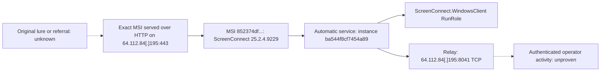

# Tracing a ScreenConnect MSI to its delivery host and relay

**Assessment date:** 29 September 2026 (UTC)  
**Case:** SC-852374df  
**Scope:** Static sample analysis, existing public sandbox reports, and passive infrastructure records.

 **The configured ScreenConnect relay / suspected C2 is `64.112.84[.]195:8041/TCP`.** An existing Hatching Triage sandbox report for the exact sample also records bidirectional TCP traffic to that destination from the ScreenConnect service. The same IP has a publicly observed ScreenConnect portal and was observed serving the exact analyzed MSI over **plain HTTP on TCP 443**. Confidence is high in the sample-to-infrastructure relationship. The operator and any named threat group remain unknown.

This case applies the evidence, infrastructure, and RMM workflow in the [Threat-Actor-Tracking Field Guide](../../docs/field-guide.md). The sample is publicly listed by MalwareBazaar. This is a sample-to-infrastructure assessment: no victim endpoint telemetry was available to establish whether a particular deployment was authorized or what a remote operator did.

## Evidence linking the sample to the host

The MSI's SHA-256 was independently calculated and matches the public sample record:

```text
852374df118e93ba75d10d516237ebee894d435487c58bb35f436aa387cfd775
```

The file is 9,957,376 bytes. A verified working copy was inspected through the Windows Installer database API in read-only mode. The embedded cabinet was extracted without installation or executing payloads; all 18 extracted file sizes match the MSI File table.

Two configuration locations agree on the relay host, port, and full server identity key:

| Evidence | Value / relationship |
|---|---|
| MSI Property: `SERVICE_CLIENT_LAUNCH_PARAMETERS` | `?e=Access&y=Guest&h=64.112.84.195&p=8041&k=…` |
| Extracted `system.config`: `ClientLaunchParametersConstraint` | `?h=64.112.84.195&p=8041&k=…` |
| MSI ServiceInstall: `Arguments` | `"[SERVICE_CLIENT_LAUNCH_PARAMETERS]"` |
| MSI ServiceInstall: `Name` | `[SERVICE_NAME]` → `ScreenConnect Client (ba544f8cf7454a89)` |
| MSI ServiceInstall: `StartType` | `2` — automatic start |
| MSI Component / File tables | Service component maps to `ScreenConnect.ClientService.exe` |

The vendor's [integration guide](https://docs.connectwise.com/ScreenConnect_Documentation/Developers/Integration_guide) identifies `h` as the relay host, `p` as its port, and `k` as the key used to verify server identity. Its [required ports documentation](https://docs.connectwise.com/ScreenConnect_Documentation/Get_started/Required_ports_for_ConnectWise_ScreenConnect) identifies TCP 8041 as the default on-premises relay port. This is therefore a configured remote-control destination, rather than an unrelated string found in the installer. Static configuration does not prove a successful connection.

## Infrastructure and external corroboration

| Role | Indicator | Evidence and time |
|---|---|---|
| Relay / suspected C2 | `64.112.84[.]195:8041/TCP` | MSI launch parameters plus extracted configuration; Shodan InternetDB also lists port 8041 |
| Exact-sample distribution | `hxxp://64.112.84[.]195:443/Bin/ScreenConnect.ClientSetup.msi?e=Access&y=Guest` | Six existing urlscan search records report the identical SHA-256 and file size |
| ScreenConnect web portal | `hxxp://64.112.84[.]195:443/` | Existing urlscan record at `2026-09-29T13:00:18.979Z`, title `ScreenConnect Remote Support Software`, HTTP 200 |
| Hosting / route context | Hyonix LLC; AS931; `64.112.84.0/24`; `HYONIX-MIA1` | ARIN RDAP and RIPEstat lookups collected during this analysis |

The six retrieved download observations span `2026-09-29T12:30:21.891Z` through `2026-09-29T15:04:09.744Z`. These are bounds of the retrieved records, not campaign first/last seen. The latest record reports HTTP 200 and `Microsoft-HTTPAPI/2.0`. All six come from one platform; they must not be counted as six independent intelligence sources. The public scan submitters may themselves be researchers.

Source records: [urlscan search API](https://urlscan.io/api/v1/search/?q=ip%3A64.112.84.195&size=20), [latest matching download record](https://urlscan.io/result/01a0edb1-5932-73bc-bec8-5cdd4e8cee6b/), [portal record](https://urlscan.io/result/01a0ed40-562f-70a9-840b-ee8cb516a398/), [ARIN RDAP](https://rdap.arin.net/registry/ip/64.112.84.195), [RIPEstat route](https://stat.ripe.net/data/network-info/data.json?resource=64.112.84.195), [RIPEstat AS931](https://stat.ripe.net/data/as-overview/data.json?resource=AS931), and [Shodan InternetDB](https://internetdb.shodan.io/64.112.84.195).

Shodan's response lists ports 443 and 8041 and no hostnames. It supplies no observation timestamp or TLS certificate. **Port 443 must not be assumed to mean HTTPS:** the corroborating urlscan records explicitly use `http://`. No hostname is present in the extracted relay configuration. Reverse-DNS queries timed out, so absence of a PTR record is not established. Provider identity, subnet, and location do not identify the operator or make neighboring IPs malicious.

## Configuration pivots for hunting

| Pivot | Value |
|---|---|
| Product / service | `ScreenConnect Client (ba544f8cf7454a89)` |
| Instance identifier | `ba544f8cf7454a89` — configuration identifier, not a victim session GUID |
| Product version | `25.2.4.9229` |
| Local URL scheme | `sc-ba544f8cf7454a89` |
| ProductCode | `{919EA92C-1C59-BFD5-B94D-700AF73C2F8F}` |
| UpgradeCode | `{DB1244CB-16B0-3CAE-BA54-4F8CF7454A89}` |
| Configured directory | `[ProgramFilesFolder]\ScreenConnect Client (ba544f8cf7454a89)` |
| Service registry hunt | `HKLM\SYSTEM\CurrentControlSet\Services\ScreenConnect Client (ba544f8cf7454a89)` |

The `k` value decodes to a 276-byte CryptoAPI PUBLICKEYBLOB containing a 2048-bit RSA public key, exponent 65537. Its SHA-256 is:

```text
df35028007fef61d290c4507dca196e6042edf8712581f33feccc8c3d0a6b711
```

The exported SPKI DER SHA-256 is `6a1f851ba65a619156c904780a17372821afe237e6def437e7dcda705e3116d1`. These fingerprints describe different encodings of the same key. This is a server identity key, not a TLS certificate or private key. Search other installers/configurations for the complete decoded `k` value or a consistently computed fingerprint. Reuse supports a configuration relationship but can also follow server migration, cloning, or compromise.

The MSI is unsigned. The initial local `Get-AuthenticodeSignature` check returned `Valid` for the inspected Windows client, service executable, and authentication package. Later review of Triage found `revoked_cert_connectwise` YARA matches on the same service and Windows client binaries, plus the credential-provider DLL. All three sandbox file hashes match the local extraction. Preserve the local result as a tool observation, not an independently verified statement of current certificate trust; the rule match and local trust check are different forms of evidence. This investigation has not independently queried the issuing CA to resolve the discrepancy. ConnectWise documents [2025 certificate revocations and changes to client signing](https://www.connectwise.com/blog/2025/new-era-remote-access-security). Neither finding identifies the operator or authorizes the deployment. The installer is consistent with a customized ScreenConnect access client; commodity binary hashes and vendor certificates alone should not become malicious block indicators.

## Corroboration from existing public reports

The [MalwareBazaar record](https://bazaar.abuse.ch/sample/852374df118e93ba75d10d516237ebee894d435487c58bb35f436aa387cfd775/) confirms the exact hash and size, labels the sample `ConnectWise`, and tags it `rmm` and `screenconnect`. It records first seen at **2026-09-29 14:11:32 UTC**, reporter `abuse_ch`, and delivery by web download. This is the repository's first-seen time; the earlier exact-hash urlscan observations remain the earlier retrieved distribution evidence. The `SE` origin-country field describes submission origin, not an attacker location. The record shows mixed vendor classifications and no comments.

Its linked [Triage behavioral report](https://tria.ge/260929-rhzctas1hy/behavioral1), submitted at 14:12 UTC on the same day, shows the service running from `C:\Program Files (x86)\ScreenConnect Client (ba544f8cf7454a89)\ScreenConnect.ClientService.exe`, PID 4040, with the same `h`, `p`, and `k` parameters extracted locally. A sandbox-specific session GUID was added during installation; that GUID is not a campaign-wide indicator.

The report's TCP panel associates the service with the relay. [Flow 41](https://tria.ge/260929-rhzctas1hy/behavioral1/analog?flow=41) records:

| Field | Recorded value |
|---|---|
| Source, sandbox only | `10.127.0.8:50004` |
| Destination | `64.112.84.195:8041/TCP` |
| Sent | 9,777 bytes / 16 packets |
| Received | 720 bytes / 11 packets |

This adds **sandbox-observed bidirectional network traffic** to the static configuration finding. It does not establish an authenticated operator session, remote commands, or compromise of a victim endpoint. The report also contains `c.pki.goog` CRL requests; these are certificate infrastructure and were excluded from malicious indicators.

MalwareBazaar links [URLhaus record 3924958](https://urlhaus.abuse.ch/url/3924958/), [CAPE analysis 89657](https://www.capesandbox.com/analysis/89657/), and [Joe Sandbox analysis 1979507](https://www.joesandbox.com/analysis/1979507). CAPE was subsequently accessible and is examined below. URLhaus and Joe Sandbox details were unavailable behind access checks during collection. Their unreviewed details are not treated as corroboration. A generic `RANSOMWARE` YARA match and Triage's Volume Shadow Copy API tag do not demonstrate file encryption or a ransomware affiliation. The process tree includes Windows restore-point creation during MSI installation, which offers a benign explanation for VSS activity.

The selected observations and collection limits are preserved in [evidence.json](evidence.json). No additional malicious host or named actor was established.


## Reconstructing the chain and testing the sandbox findings

The evidence supports a reconstruction from a publicly observed installer endpoint through installation and relay traffic. It does **not** yet reconstruct the original lure or a victim compromise. The arrows below join matching sample/configuration evidence across public observations and sandbox executions, rather than documenting one victim's complete sequence.



### Two executions reach the same relay

The Windows 11 execution in the same [Triage submission](https://tria.ge/260929-rhzctas1hy/behavioral2) confirms the destination again. This adds repeatability across two environments, not evidence of two victims or two independent campaigns.

| Existing execution | Flow | Sent | Received | Meaning |
|---|---|---|---|---|
| Windows 10 | [41](https://tria.ge/260929-rhzctas1hy/behavioral1/analog?flow=41) | 9,777 bytes / 16 packets | 720 bytes / 11 packets | Bidirectional traffic to configured relay |
| Windows 11 | [12](https://tria.ge/260929-rhzctas1hy/behavioral2/analog?flow=12) | 12,759 bytes / 17 packets | 707 bytes / 11 packets | Same destination; report lists one TCP connection and no requests or UDP |

The Windows 11 service PID is 1148; its sandbox-local source is `10.127.0.235:49945`. The installation session GUID differs from both Windows 10 and CAPE. These sandbox PIDs, source addresses, and GUIDs should not become campaign indicators. Because the configured destination is a literal IP, a hunt based only on DNS queries can miss this connection.

CAPE's 238-second execution instead reports unsuccessful attempts to `64.112.84.195:8041` from service PID 4140. Its `dead_connect` finding contains six call references to that destination. **This does not establish that the host was globally offline:** Triage records traffic in both directions, and the observations have different execution environments and timing. No new malicious destination was identified in the reviewed report data.

### Runtime configuration recovered

CAPE preserves a 561-byte `user.config` under:

```text
C:\Windows\System32\config\systemprofile\AppData\Local\ScreenConnect Client (ba544f8cf7454a89)\user.config
```

Its reported SHA-256 is `abb9fb9d43172f64c1b93a3dcb99956687e5883a14385e3eccced3fc8cfe5af7`. The `HostToAddressMap` value is:

```text
64.112.84.195=64.112.84.195-9%2f29%2f2026%201%3a19%3a09%20PM
```

This is runtime corroboration of the same address, with no additional domain. The date decodes to `9/29/2026 1:19:09 PM` in the sandbox's context; it is not a victim installation time. CAPE also lists configuration activity under `C:\ProgramData\ScreenConnect Client (ba544f8cf7454a89)` and the interactive user's local AppData. Those are useful locations to preserve during endpoint collection. The accompanying [runtime configuration transcription](cape-user.config-evidence.txt) is a readable transcription, not the original binary-identical file.

### The seven CAPE “payloads” require interpretation

CAPE lists one PE memory extract and six data/shellcode extracts. I compared the PE's hash to the original MSI contents and downloaded the six data archives for static inspection. All six decoded contents match their report hashes; none was executed.

* **The PE is an existing packaged component.** Its SHA-256, `319ba24115e64ea4b714caf4e88d3d5a658defd51d714c2291b9758466925281`, exactly matches the extracted 68,096-byte `ScreenConnect.ClientService.dll`. CAPE's version and original-filename metadata agree. Finding it in `ScreenConnect.WindowsClient.exe` memory does not establish a second RAT.
* **The 4,522-byte injection/data extract names the existing service executable.** CAPE associates it with service PID 4140 and WindowsClient PID 3260. Its readable string is the installed ScreenConnect service path. This records a service-to-client memory relationship; the extract alone does not establish a separately downloaded payload.
* **Two small extracts may reflect sandbox instrumentation.** The 308-byte and 295-byte extracts contain `C:\yz894hlu\dll\kyAHoN.dll` and `C:\yz894hlu\dll\PGBVAz.dll`. CAPE's public [constants](https://github.com/kevoreilly/CAPEv2/blob/master/analyzer/windows/lib/common/constants.py) and [process code](https://github.com/kevoreilly/CAPEv2/blob/master/analyzer/windows/lib/api/process.py) describe randomized monitor DLL names and injection into monitored processes. Instrumentation is a plausible explanation, not a conclusive attribution without this run's monitor log. These paths are excluded from malicious IOCs.
* **No additional network destination appeared in the six extracts' ASCII/UTF-16LE strings.** This was a limited static check, not full disassembly or decryption. The remaining small data regions are unresolved; encoded configuration is not ruled out.

Exact hashes, sizes, string results, source links, and interpretation limits are retained in [evidence.json](evidence.json). A count of seven extracted objects must not be reported as seven malicious stages.

### More endpoint artifacts to hunt

The original MSI Registry table supplies additional concrete collection targets. Apart from the observed service activity, these are **installer declarations**; their presence on a particular victim still needs verification.

| Artifact | Exact target or value | Interpretation |
|---|---|---|
| Automatic service | `ScreenConnect Client (ba544f8cf7454a89)` | Service creation/running confirmed in sandboxes; automatic start is declared by MSI |
| Safe Mode with Networking registration | `HKLM\SYSTEM\CurrentControlSet\Control\SafeBoot\Network\ScreenConnect Client (ba544f8cf7454a89)` → `Service` | Installer declares service eligibility in this boot mode; no Safe Mode reboot observed |
| LSA authentication package | `HKLM\SYSTEM\CurrentControlSet\Control\Lsa`, value `Authentication Packages` | MSI declares appending `ScreenConnect.WindowsAuthenticationPackage.dll`; registration is not proof of credential dumping |
| Credential provider | `{6FF59A85-BC37-4CD4-9651-21C89F68C1A3}` under `HKLM\Software\Microsoft\Windows\CurrentVersion\Authentication\Credential Providers` | MSI registers the packaged provider and its COM class; not proof of a hijacked existing COM class |
| COM implementation | `HKCR\CLSID\{6FF59A85-BC37-4CD4-9651-21C89F68C1A3}\InprocServer32` | Points to packaged `ScreenConnect.WindowsCredentialProvider.dll`; check appropriate registry views |
| Protocol handler | `HKCR\sc-ba544f8cf7454a89\shell\open\command` | Invokes `ScreenConnect.WindowsClient.exe` with the supplied URL argument |
| Runtime service registry | `HKLM\SYSTEM\ControlSet001\Services\ScreenConnect Client (ba544f8cf7454a89)\ImagePath` | Listed in CAPE's modified-key summary |
| Runtime configuration | Instance directories in system-profile AppData, ProgramData, and user AppData | Preserve `user.config`, configuration timestamps, and any adjacent logs |

The installation and packaged authentication components are consistent with ScreenConnect functionality. Their security-sensitive locations make them valuable evidence, but do not independently demonstrate password theft or an additional persistence implant.

### Alerts that do not yet prove attacker actions

CAPE's cookie-access alert cites the directory `C:\Users\Louise\AppData\Local\Microsoft\Windows\INetCookies`. It does not, by itself, establish recovered cookies, browser credential theft, or exfiltration. The sandbox username is not a victim identity. Likewise, the reviewed process trees and executed-command summary show installer/service/client activity, not confirmed operator-issued PowerShell, payload deployment, or lateral movement. Short sandbox runs cannot rule out later activity.

Keep CAPE's installation command in sandbox context: `/qb ACCEPTEULA=1 LicenseAccepted=1` comes from the sandbox execution, not a recovered victim lure. Triage's restore-point/VSS activity is not evidence of shadow-copy destruction. The unresolved certificate-revocation discrepancy remains as documented above.

### Timeline with source boundaries

| Time on 29 September 2026 | Observation | Boundary |
|---|---|---|
| 12:30:21.891 UTC | Earliest retrieved exact-hash download record | Earliest within this result set, not campaign start |
| 13:00:18.979 UTC | ScreenConnect portal observed on HTTP/443 | Existing public scan |
| 14:11:32 UTC | MalwareBazaar first seen | Repository ingestion |
| 14:12 UTC | Triage submission | Sandbox submission, not victim execution |
| 14:15:27–14:19:25, as displayed | CAPE execution | Timezone not established; API-call times are about an hour behind this display, so do not merge without normalization |
| 15:04:09.744 UTC | Latest retrieved exact-hash download record | Latest within this result set, not proof of current availability |

### Methodology and remaining collection priorities

[Huntress's ClickFix/RAT investigation](https://www.huntress.com/blog/chatgpt-custom-gpts-clickfix-rat) is a methodological reference: reconstruct the delivery chain, trace recovered stages, correlate endpoint behavior, and explicitly retain unresolved questions. Those practices informed the deeper artifact review here.

For this case, the highest-value missing evidence is the original download/lure and victim process ancestry, followed by activity after the ScreenConnect service started. Preserve browser download/history records, the MSI's `Zone.Identifier` if present, email or chat referral, process/service events, and ScreenConnect-related logs/configuration. Correlate EDR descendants and network events with the instance and server key. This can distinguish mere installation from operator control and may reveal further infrastructure or payloads. The present reports do not justify inventing a ClickFix, phishing, ransomware, or named-actor attribution.

## Confidence, gaps, and defensive follow-up

**High confidence:** exact sample identity, configured relay, instance identifier, the exact-sample distribution relationship in existing public records, and bidirectional relay traffic in an existing sandbox run. **Unknown:** application-level relay authentication, actual victim connections, victim installation time, operator commands, file transfers, other campaign infrastructure, original victim delivery mechanism, and operator identity.

Plausible explanations include unauthorized deployment by an operator, abuse of a compromised ScreenConnect server, or an authorized support instance incorrectly classified in isolation. The sample listing and investigation context make unauthorized RMM use the working hypothesis, but the sample alone does not distinguish these explanations. No named threat-actor attribution is justified.

For an environment with a matching detection, prioritize outbound traffic to this exact IP, particularly TCP 8041 and 443, and service/path/command-line matches for the instance identifier. Correlate installation with the parent process, initiating user, source URL/email, service-creation events, and subsequent ScreenConnect child processes, commands, and transfers. Validate against approved RMM inventory. Preserve relevant endpoint and network evidence before removal; apply incident containment to unauthorized instances. Treat AS931 and the /24 as context rather than a subnet-wide block recommendation.

Local sample analysis was static; the investigation also reviewed existing Triage and CAPE dynamic reports and statically inspected six CAPE memory-data extracts. No sample was executed or uploaded by this investigation, no new external scan was submitted, and no connection was made to the suspect host. Public search/registry/scan databases and vendor documentation were queried. Detailed urlscan result access required login, and full Shodan/Censys pages were unavailable; retained urlscan evidence is from its public search API. No TLS-certificate relationship has been established.

## Evidence package

| File | Contents |
|---|---|
| [evidence.json](evidence.json) | Selected MSI tables, full extracted launch/configuration values, 18-file manifest, signature observations, public-report observations, and six memory-extract string results |
| [indicators.json](indicators.json) | Contextual indicators, roles, confidence, and source links; includes indicators that require context rather than automatic blocking |
| [server-public-key.pem](server-public-key.pem) | Extracted server identity public key; contains no private key |
| [system.config.txt](system.config.txt) | Text copy of the original static configuration constraint |
| [cape-user.config-evidence.txt](cape-user.config-evidence.txt) | Normalized transcription of CAPE's runtime configuration; not a binary-identical copy |
| [SHA256SUMS](SHA256SUMS) | Integrity hashes for this report and its companion files |

The JSON is an analyst-curated evidence ledger. Referenced report values remain third-party observations, and links may later require authentication or become unavailable. The package includes no MSI, executable, memory dump, private credential, or victim telemetry. Suspect addresses are defanged in the narrative where practical; JSON and configuration values retain their exact machine-readable forms for reproducibility.

